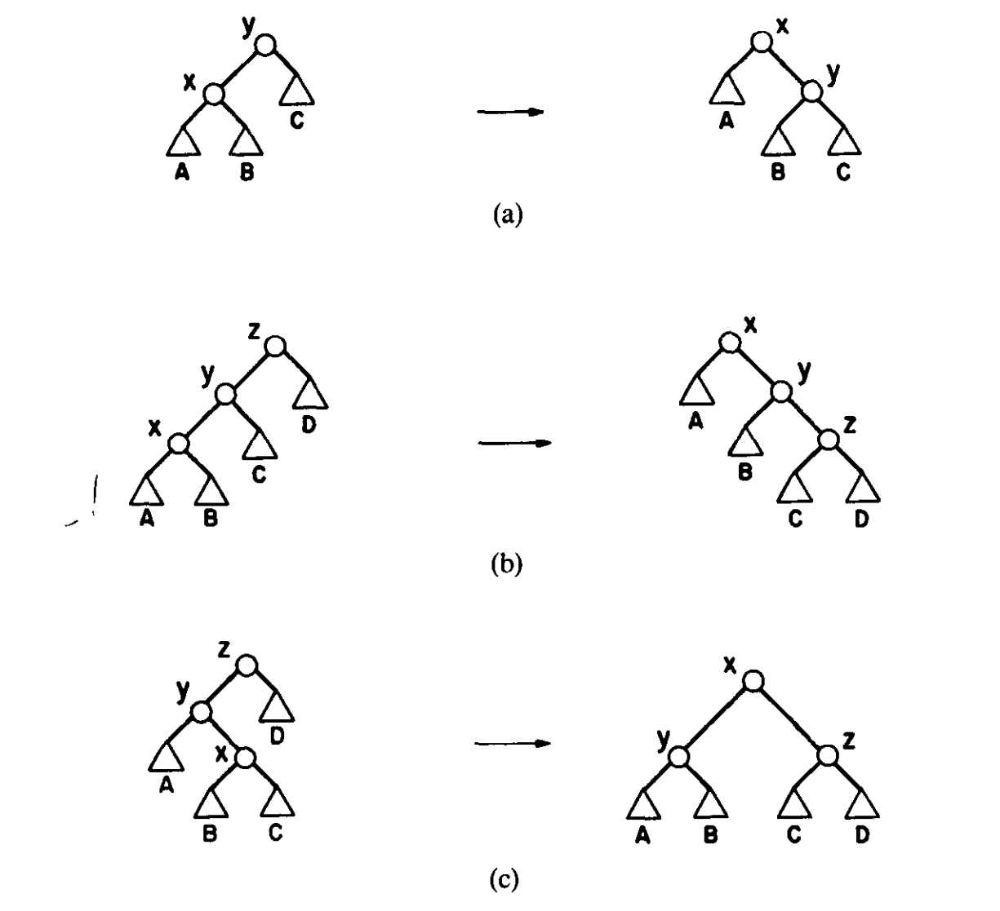

# 摊还分析

摊还分析的方法主要有三种：

（1）聚合法

该方法在能够求得$n$次操作总计的最坏复杂度$T(n)$时较为有效，即把整个序列的最坏复杂度均摊到每一次操作上，这样可以求得摊还复杂度为$\Theta(\frac{T(n)}{n})$。

（2）记账法

该方法是势能法的前身，做便宜的操作的时候额外支付额度进入额度库（初始为零），而昂贵的操作从额度库中取出一定额度来抵消支付单次高额时间成本（余额非负）。

（3）势能法

重点讲解本方法。该方法起源于物理学中的“势能”概念，得益于这个虚拟变量势能$\Phi_i$，我们可以将原本不方便直接估计复杂度的真实开销$c_i$映射到变量$\hat c_i$，从而方便后续的计算估计复杂度。我们定义单次操作的真实时间开销为$c_i$，均摊开销为$\hat{c_i}$，满足以下恒等式：

```math
\sum\limits^{m}_{i=1} c_i= \sum\limits^{m}_{i=1}(\hat{c_i}-\Phi_i+\Phi_{i-1})=\Phi_0-\Phi_m +\sum\limits^{m}_{i=1} \hat{c_i} \\
\sum\limits^{m}_{i=1} \hat{c_i}= \sum\limits^{m}_{i=1} c_i-\Phi_0+\Phi_m 
```

通过选取合适的势能函数，我们可以规避原来成本$c_i$的抖动特性，从而得到累计$m$次操作的均摊复杂度上界。观察势能法的定义，我们不难发现势能法势能函数选取的一些性质和限制：

- $\Phi_i$通常有统一的常数下界，另计初始项
- 在做简单操作时，势能一般会增加，在做复杂操作时，势能往往会减少，产生抵消的效果

看似这里的公式增加了一项，但是为什么它反而会简化计算呢？原因在于通过引入适当的势能函数，我们可以通过数学近似计算和不等式变换，有时让复杂操作的$c_i-\Phi_{i-1}+\Phi_i$成为一个常数（在记账法中也可让这个数值为0，用此前积累的势能来抵消本次操作），同时让简单操作的$\Delta \Phi$容易计算（一般是常数或者相抵项），让两者的总和成为一个平凡的简单求和操作，达到简化计算的目的。

下面我们通过几个例子来讲解势能法。

a）`MultiPop`模型

在普通的栈模型里面（初始为空），我们每次操作只能压入一个元素，或弹出一个元素，均消耗$O(1)$的时间，在`MultiPop`模型中，我们引入弹出多个元素的操作`MultiPop`，一次弹出$m$个元素，但是消耗$O(m+1)$的时间。为了消除这种抖动的复杂度，我们选取的势能函数为$\Phi(S)=\#\{S中元素\}=|S|$，然后我们思考每次的操作（只计压弹次数）：

- 压入元素，势能增加，摊还成本$\hat{c_i}=2$，其中一半来自这次简单操作的真实开销$c_i=1$，另一半来自势能增加的额外成本$\Delta \Phi=1$。
- 弹出多个元素，势能减少，摊还成本$\hat{c_i}=0$，其中真实开销$c_i=m$，但是势能的减少$\Delta\Phi=-m$恰好抵消了$c_i$，这样不论弹出多少个元素，摊还成本都是常数！

b）`Move-To-Front`（下称MTF）线性搜索算法

在普通的线性表搜索算法中，我们每次搜索到一个元素之后直接返回结果不做任何操作。在MTF优化下，我们将每次查询到的元素逐次交换至线性表头部，不改变其余元素的相对位置。通过这个操作，我们可以保证被最近访问到的元素始终保持在线性表的靠前位置，在实际应用中有重要意义。我们使用势能法来证明一个结论（交换计费）：MTF的总成本永远不会超过同模型的任意线性表下的搜索算法总成本的4倍（哪怕这个虚拟算法强大到能够预知访问序列而动态做出最优调整）

为方便说明，我们假定MTF算法下维护的序列为$X$，而任意其它算法下维护的序列为$Y$

选取势能函数：$\Phi=\#\{X相对于Y的逆序对\}$，假定在操作开始时两个序列完全相同，$\Phi_0=0$，然后即可对每次操作进行分析：

- 访问元素。假定我们需要在整个序列中访问元素$x$，且$x$在序列$X$，$Y$中的位置分别为$i$，$j$，对于$y=X_k(k<i)$，我们可以根据性质将其分为两类。第一类，$y$在序列$Y$中的$x$前，记这样的$y$的数量为$a$，第二类，$y$在序列$Y$中的$x$后，记这样的$y$数量为$b$，于是我们可以得到这样的数量关系：$a+b=i-1,\ a\leq j-1$.
- 移动元素至表头。在MTF在位置$i$找到元素$x$之后花费$i-1$次交换将其移动至表头，此时观察势能变化$\Delta \Phi$，对于第一类元素，操作后$x,y$从原本的相对顺序改变为相对逆序，势能变化$\Delta\Phi_1=a$，而第二类元素将$x,y$从相对逆序改为相对顺序，势能变化$\Delta\Phi_2=-b$，故MTF移动造成的势能变化为$\Delta\Phi'=a-b$.
- 考虑任意算法的交换，假设任意算法本次交换$q$次相邻元素，由于一次交换最多改变$1$的势能，故我们可以推出每访问一次元素，势能的变化满足$\Delta\Phi\leq a-b+q$
- 对于MTF算法的查找过程，$\hat{d^{(1)}_k}=i+\Delta\Phi\leq i+a-b+q=2a+b+1-b+q\leq 2a+q+1\leq 2j+q-1\leq 2(j+q)=2c_k$，注意这里为了消去$b$项，我们暂时不计入每次的交换成本$i-1.$
- 再考虑MTF的交换花费，我们会发现每次操作时交换次数总是比查找成本恰好少$1$，即有$d_k^{(1)}=d_k^{(2)}+1$，两边累加，则有$\sum d_k^{(2)}<\sum d_k^{(1)}$，由势能非负有$\sum d_k^{(1)}\leq\sum \hat{d_k^{(1)}}$，所以全部操作的实际成本相对任意算法满足$\sum d_k\leq 4\sum c_k$，这个常数$4$也被成为MTF算法的竞争比上界。

c）splay树

在一个理想的状态下（树绝对平衡），在splay树中访问一个元素需要$O(\log n)$次，很容易证明其单次操作的复杂度为$O(\log n)$，但是当遇到退化成链的斜树时，单次操作的成本就会变为$O(n)$，但是这样的单次访问可能改善树的形态，但不保证后续操作的复杂度接近理想区间，因此需要引入摊还分析来评估单次操作的摊还成本。

此处选取的势能函数为$\Phi=\sum r(x)$，其中$r(x)=\log_2 s(x),\ s(x)=\sum\limits_{j\in\text{subtree}(x)}v(j)$，在简单情况下，以下取$v(t)=1$，$s(x)$表示以$x$为根节点的子树的节点总数。

这个势能函数十分精巧，它具有性质：

- 完全平衡时，势能较小，一颗绝对平衡的树势能数量级约为$O(n)$，链状时，势能较大，最大可达$O(\log n!)=O(n\log n).$
- 对数不等式中，$\log_2\frac{a+b}{2}\geq\frac{\log_2 a+\log_2 b}{2}\Leftrightarrow \log_2 a+\log_2 b-2\log_2(a+b)\leq -2$，正好抵消了两次旋转的成本$2$



接下来以Zig-Zig情况为例，来具体分析其摊还成本。我们先假定在变换前后的单结点势能分别为$r(x),\ r(y),\ r(z)$和$r'(x),\ r'(y),\ r'(z)$。我们不难发现以下关系：$r(z)=r'(x),\ r(y)\geq r(x),\ r'(y)\leq r'(x).$ 

- 旋转费用，即$c_i$，由于单次旋转只需要花费常数次操作，我们暂定其成本为$1$.故在Zig-Zig情况下，$c_i=2$
- 树形状调整的记账量，即势能的变化$\Delta\Phi$。我们考虑单次Zig-Zig操作，势能的变化为$\Phi_i-\Phi_{i-1}$
- 开始估计摊还花费$\hat{c_i}=c_i+\Phi_i-\Phi_{i-1}=2+[r'(x)+r'(y)+r'(z)]-[r(x)+r(y)+r(z)]=2+[r'(x)-r(z)]+r'(y)+r'(z)-r(x)-r(y)\leq 2+0+r'(x)+r'(z)-r(x)-r(x)=2+r'(x)+r'(z)-2r(x).$
- 为了能够让摊还花费可以累加，所以我们需要消去$r'(z)$和常数项$2$，转化$r'(x)$才能够得到一个良好的形式，基于这个动机，我们利用不等式：$r(x)+r'(z)=\log_2 s(x)+\log_2 s'(z)\leq 2\log_2[s(x)+s'(z)]-2\leq 2\log_2 s'(x)-2=2r'(x)-2$，带入摊还花费计算可得$\hat{c_i}\leq 2+3r'(x)-2-3r(x)\leq 3[r'(x)-r(x)].$

然后计算Zig情况：

- 摊还花费$\hat{c_i}=1+\Delta\Phi=1+r'(x)+r'(y)-r(x)-r(y)=1+r'(y)-r(x)$
- 观察树的形态，利用不等式$r'(y)\leq r'(x)$
- 最后合并计算可得$\hat{c_i}= 1+r'(y)-r(x)\leq 1+r'(x)-r(x)$

最后计算Zig-Zag情况：

- 旋转费用$c_i=2$.
- 摊还花费$\hat{c_i}=c_i+\Phi_i-\Phi_{i-1}=2+[r'(x)+r'(y)+r'(z)]-[r(x)+r(y)+r(z)]=2+[r'(x)-r(z)]+r'(y)+r'(z)-r(x)-r(y)\leq 2+r'(y)+r'(z)-2r(x)$
- 为了消去$r'(z)$和$r'(y)$项，我们利用不等式：$r'(z)+r'(y)=\log_2 s'(z)+\log_2 s'(y)\leq 2\log_2[s'(z)+s'(y)]-2\leq 2\log_2 s'(x)-2=2r'(x)-2$，简单变形之后得到$r'(z)\leq 2r'(x)-2-r'(y)\leq 2r'(x)-2$
- 最终合并计算$\hat{c_i}\leq 2+2r'(x)-2-2r(x)=2[r'(x)-r(x)]$

合并三个不等式关系，我们证明了单步摊还成本$\hat{c_i}\leq 1+3[r'(x)-r(x)]$，这就是Splay树上的Access Lemma的局部估计.

我们下面分析Splay树上的伸展的摊还成本。

访问时，被访问节点从Splay树上一路旋转至根节点，假设经过累计$k$次Zig-Zig/Zig/Zig-Zag操作后，被访问节点到达了根节点，那么该次伸展的摊还成本$\hat{c_i}=\sum\limits_{j=1}^k c_j+\sum\limits_{j=1}^k \Delta\Phi_j=\sum\limits_{j=1}^k(c_j+\Delta \Phi_j)\leq 1+3[r(\text{root})-r(x)]$，由于Zig操作至多执行一次，因此常数项取$1$.无论Splay树是否平衡，都有$r(\text{root})\leq \log_2 s(\text{root})=\log_2 n=O(\log n)$，所以该次伸展的摊还成本$\hat{c_i}\leq 1+3O(\log n)=O(\log n)$，访问亦然。

Splay树的删除、插入分析方法相似，只要根据Access Lemma进行简单推理即可证明复杂度。

我们不难发现，Splay树的访问逻辑和MTF极其相似，那是不是意味着存在b）中一样的一个常数值竞争比，证明Splay树的动态最优性呢？但是二叉搜索树尚未找到像线性表的逆序对一样的可证该猜想的势能函数，这个命题至今都是一个猜想。但是2026年7月，这个竞争比上界被优化到$O(\log\log n \log^2\log\log n)=\tilde O(\log \log n)$（含初始项）。

### Reference

https://www.cs.princeton.edu/courses/archive/spr04/cos423/handouts/amortized%20comp%20complex.pdf

https://dl.acm.org/doi/pdf/10.1145/3828.3835

https://arxiv.org/pdf/2607.18498
